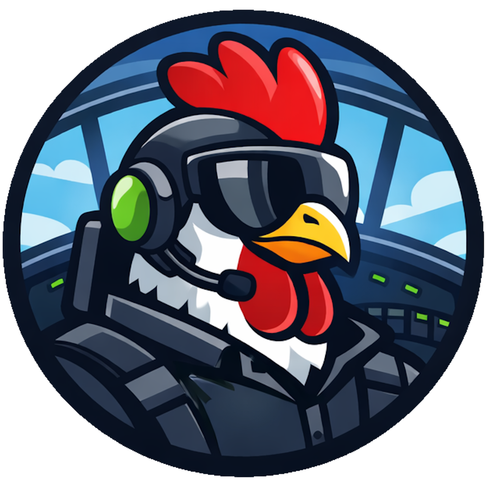

  

  
  
  
  

  
  <!---->
  

# Cockpit

**Full visibility and control for GitHub Copilot. Review every change. Run parallel workflows. Ship with confidence.**

A powerful GUI for GitHub Copilot CLI that brings transparency, control, and customization to AI-assisted development.

## Why Cockpit?

- **Free and Open Source** — No licensing costs, no vendor lock-in. Full transparency into how your AI workflows operate with community-driven development.
- **Fully Customizable** — Tailor the interface, theme, layout, and workflows to match your personal setup. Extend with plugins for your team's specific needs (coming soon).
- **Transparent & Traceable** — See every decision the AI makes. Comprehensive activity logs, token usage tracking, and audit trails keep you in control and informed.

## Key Features

### Core Capabilities
- **Multi-session management** — Run and switch between multiple AI coding threads without losing context
- **Integrated terminal** — Stay close to shell-based workflows with a polished interface; run commands and attach output to prompts
- **Git diff viewer** — Inspect generated changes before accepting them; review file-level diffs to stay in control of code quality
- **Image & attachment support** — Bring richer context into prompts with files and visuals for debugging and UI work
- **Transparent chat history** — Clean, complete conversation record with no hidden steps; audit decisions easily
- **Fine-grained permissions** — Control autonomy globally, per session, or with YOLO mode for intentional speed
- **CLI + GUI continuity** — Start a session in CLI and continue in Cockpit (and vice versa) without losing momentum

### Advanced Features
- **Canvas support** — Visualize architectural decisions, data flows, and UI designs inline *(Partial support)*
- **Bring your own key (BYOK)** — Use custom model/provider configs with secure key handling and capability hints
- **System message customization** — Control prompt sections with replace, remove, append, or prepend overrides
- **OpenTelemetry diagnostics** — Diagnose performance by tracking token usage and time per operation; export telemetry for analysis

### Coming Soon
- **Plugins** — Extend Cockpit with custom integrations for Jira, Slack, GitHub Actions, and more
- **Git worktrees** — Work in multiple branches at once with isolated checkouts inside Cockpit workflows
- **Full theme customization** — Fine-tune colors, contrast, and layout styling to match your personal setup

## Requirements

- [GitHub Copilot subscription](https://github.com/features/copilot)
- [GitHub CLI](https://github.com/features/copilot/cli) installed and configured (`gh auth login`)

## Platforms

- **Windows 10+**
- Potentional **macOS 15+ (Catalyst)** support if there is demand for it
- Built with .NET MAUI

## Getting Started

1. [Download the latest release](https://github.com/IeuanWalker/Cockpit/releases/latest)
2. Install and run Cockpit
3. Connect your GitHub Copilot account
4. Start your first session or continue from CLI

## Learn More

- [Visit the landing page](https://ieuanwalker.github.io/Cockpit/)
- [View on GitHub](https://github.com/IeuanWalker/Cockpit)
- [GitHub Copilot Documentation](https://docs.github.com/en/copilot)

---

Built with ❤️ for developers who want control, transparency, and speed in their AI-assisted workflows.
